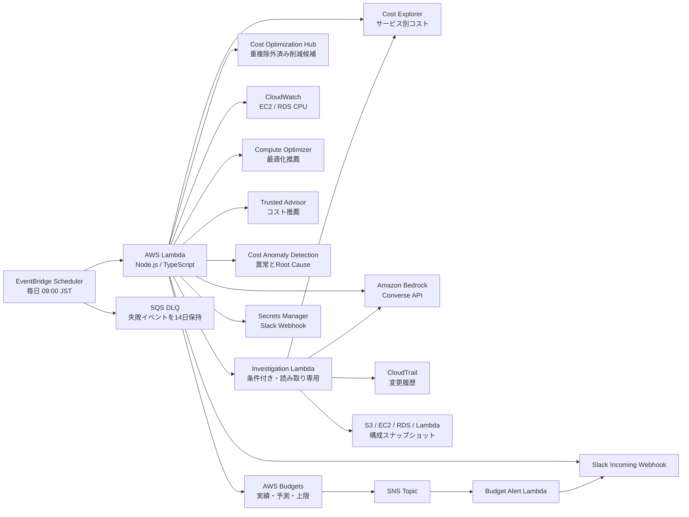

# AWS FinOps Agent for Slack

AWSのコストと利用状況を毎日収集し、生成AIが「何が変わったか」「次に何を確認すべきか」を短くまとめてSlackへ通知する、読み取り中心のFinOps Agentです。AWS Budgetのしきい値到達は、日次レポートを待たずSlackへ即時通知できます。

AWS CDK（TypeScript）でデプロイでき、Cost Explorer、AWS Budgets、Cost Optimization Hub、CloudWatch、Compute Optimizer、Trusted Advisor、Cost Anomaly Detectionの情報を組み合わせます。AI分析にはAmazon Bedrock Converse APIを使用します。

一定以上のコスト増加を検知した場合は、専用の調査Agentが追加で読み取り調査を実施します。AgentはCost ExplorerのUsage Type / Operation / Region内訳、CloudTrail変更履歴、S3・EC2・RDS・Lambdaの現在スナップショットを必要に応じて照合し、根拠と確信度をSlack要約へ渡します。

> このAgentはAWSリソースを自動停止・削除・購入しません。通知される削減案は、必ず担当者が影響を検証してから実施してください。

## 目次

- [クイックスタート](#クイックスタート)
- [設定](#設定)
- [IAMとセキュリティ](#iamとセキュリティ)
- [コスト](#コスト)
- [ログとトラブルシューティング](#ログとトラブルシューティング)
- [既知の制約](#既知の制約)
- [開発](#開発)
- [アンインストール](#アンインストール)

## できること

- 直近7日とその前の7日のAWSコストを比較
- 当月累計とCost Explorerの月末予測を表示（取得不可時は線形見込みへフォールバック）
- コスト変動が大きいサービスを上位3件に絞って表示
- CloudWatchから低CPU利用のEC2/RDS候補を収集
- Compute OptimizerからEC2/EBS/Lambda/RDS/アイドルリソースの推薦を収集
- Trusted Advisorからコスト最適化の推薦を収集
- AWS Budgetsから実績・予測・上限超過を収集
- AWS Budgetsの実績コストしきい値（例: 50% / 75% / 90%）と予測コストしきい値（既定90%）をSNS経由でSlackへ即時通知
- Cost Optimization Hubから重複を除外した削減候補を収集
- 既に有効なコスト配分タグのキーだけを収集（値・配賦額は扱わない）
- Cost Anomaly Detectionから直近の異常と影響額を収集
- 大きなコスト増加だけを対象に、最大3サービス・最大6ツール呼び出しの追加調査を実行
- 全サービスでUsage Type / Operation / Regionの差分を調査可能。EC2、RDS、Lambda、S3はリソース構成も追加確認
- CloudTrail Event historyの管理イベントと費用変動を照合し、変更の相関を示す（因果関係は断定しない）
- Amazon Bedrockで日本語の要約と優先アクションを生成
- Slack Block Kitで、最大7ブロックの簡潔な通知を投稿
- Cost Explorer、Budgets、Cost Optimization Hubなどの調査画面へSlackから移動
- AWS APIやAI分析の一部が失敗しても、取得できた情報で通知を継続

## 通知イメージ

```text
AWS FinOps｜2026-07-14｜🔴 要対応

7日コスト        前週比
$1,245.47        ↓ $918.54 (-42.4%)

当月累計          CE月末見込
$2,995            $6,584

Budget             削減候補/月（重複除外）
🔴 $2,995 / $200  COH $1,174（控除前）

要点
全体コストは減少していますが、S3が前週比98%増加しています。
バケット・Usage Type別に増加元を確認してください。

今やること
① P0 S3増加元をCost ExplorerとStorage Lensで確認する
② P1 低利用EC2/EBSの停止・削除可否を所有者へ確認する

変化が大きいサービス
↑ S3 $461 (+98%)   ↓ EC2 $443 (-52%)

証拠: CW ✓  CO ✓  TA ✓  Budget ✓  Hub ✓  Tag –  異常 ✓
詳細: 内訳 ・ Budget ・ 最適化Hub ・ 異常 ・ 対象リソース
```

判定は次のルールです。

| 判定 | 条件 |
| --- | --- |
| 🔴 要対応 | P0アクション、Budgetの実績/予測超過、またはCost Anomalyが1件以上 |
| 🟡 要確認 | P1アクション、前週比の絶対値が20%以上、AIフォールバック、または収集元のエラー |
| 🟢 正常 | 上記に該当しない |

## アーキテクチャ



| データソース | 対象 | リージョン |
| --- | --- | --- |
| Cost Explorer | 請求アカウント全体、サービス別の日次コスト | `us-east-1` API |
| AWS Budgets | COST budgetの実績・予測・上限超過 | `us-east-1` API |
| Cost Optimization Hub | 重複を除外した最適化候補と月額削減見込み | `us-east-1` API |
| Cost allocation tags | 有効なタグキーのみ | `us-east-1` API |
| CloudWatch | EC2/RDSのCPU利用率 | デプロイ先リージョン |
| Compute Optimizer | EC2/EBS/Lambda/RDS/アイドル推薦 | デプロイ先リージョン |
| Trusted Advisor | コスト最適化Recommendation | グローバル |
| Cost Anomaly Detection | 直近30日のコスト異常 | グローバル |
| 調査Agent | 増加サービスの内訳、CloudTrail、リソース構成 | Cost Explorerは`us-east-1`、他はデプロイ先リージョン |
| Amazon Bedrock | 収集結果の要約と優先順位付け | 設定したBedrockリージョン/推論プロファイル |

## 調査Agentの動き

日次レポートの作成後、次の条件を満たすサービスだけを調査します。初期値は「直近7日が前の7日より **$100以上** かつ **20%以上** 増加」です。前期間が$0の新規サービスは、金額条件だけで対象になります。Taxは対象外です。

```text
定型コードで増加を検知
  → 専用LambdaがSonnet 5のTool Useで必要な読み取りを選択
  → 実装側が入力・対象サービス・回数を検証してAWS APIを実行
  → Sonnet 5が観測事実 / 原因仮説 / 確信度を分けて要約
```

Agentに書き込み系のAPI、Slack Webhook、Secrets Manager権限はありません。日次通知Lambdaと調査LambdaのIAMロールは分離されています。Agentの結論はあくまで根拠付きの仮説であり、削除・停止・購入・設定変更を実行するものではありません。

## 前提条件

- Node.js 22以上
- npm
- AWS CLI v2
- AWS CDK v2（プロジェクトのdevDependencyから`npx cdk`で実行できます）
- AWS認証情報を設定済み
- Cost Explorerを有効化済み
- 利用するBedrockモデルまたは推論プロファイルへのアクセス
- Slack Incoming Webhookを作成済み

Budgetの即時Slack通知も使う場合は、対象のCOST budgetと、実績コストの通知しきい値をあらかじめ作成してください。このCDKアプリは既存の通知へSNS購読先を追加し、予算額・しきい値・メール通知先を変更しません。

以下は未設定でもデプロイできますが、そのデータソースは`unavailable`として扱われます。

- Compute Optimizerのオプトイン
- Trusted Advisorの利用条件を満たすAWSアカウント/サポートプラン
- Cost Anomaly Detectionのモニター
- Cost Optimization Hubのオプトイン

## クイックスタート

### 1. 依存関係をインストール

```bash
npm ci
```

### 2. AWSへログイン

AWS IAM Identity Center（SSO）や短期認証情報の利用を推奨します。

```bash
export AWS_PROFILE=your-profile
export AWS_REGION=ap-northeast-1
export CDK_DEPLOY_REGION=ap-northeast-1

aws sso login --profile "$AWS_PROFILE"
aws sts get-caller-identity
```

`.env`を使う場合、AWS CLIやCDKはこのファイルを自動では読み込みません。実行前にシェルへ読み込んでください。雛形は[`.env.example`](./.env.example)です。

```bash
set -a
source .env
set +a
```

`.env`はGit管理対象外です。長期アクセスキーより、SSOや一時クレデンシャルを優先してください。

### 3. Slack WebhookをSecrets Managerへ保存

Webhook URLをソースコードやLambda環境変数へ直接書かないでください。

```bash
aws secretsmanager create-secret \
  --name finops/slack-webhook \
  --secret-string '{"url":"https://hooks.slack.com/services/REPLACE_ME"}' \
  --region "$AWS_REGION"
```

同名のSecretが既にある場合は更新します。

```bash
aws secretsmanager put-secret-value \
  --secret-id finops/slack-webhook \
  --secret-string '{"url":"https://hooks.slack.com/services/REPLACE_ME"}' \
  --region "$AWS_REGION"
```

Secretの値は、Webhook URLそのもの、`{"url":"..."}`、`{"webhookUrl":"..."}`のいずれでも読み込めます。

### 4. CDK Bootstrap

アカウント・リージョンごとに初回のみ必要です。

```bash
ACCOUNT_ID=$(aws sts get-caller-identity --query Account --output text)
npx cdk bootstrap "aws://${ACCOUNT_ID}/${AWS_REGION}"
```

### 5. 最初は定期実行を無効にしてデプロイ

初回はSchedulerとCost Anomaly monitorの新規作成を無効にし、安全に動作確認します。

```bash
npx cdk deploy \
  -c deploymentRegion="$AWS_REGION" \
  -c slackWebhookSecretName=finops/slack-webhook \
  -c scheduleEnabled=false \
  -c createAnomalyMonitor=false
```

デプロイ時に作成されるIAMポリシーの差分を確認してから承認してください。

### 6. Slackへ投稿しないdry-run

```bash
FUNCTION_NAME=$(aws cloudformation describe-stacks \
  --stack-name FinOpsFeedbackStack \
  --region "$AWS_REGION" \
  --query 'Stacks[0].Outputs[?OutputKey==`CostFeedbackFunctionName`].OutputValue' \
  --output text)

aws lambda invoke \
  --function-name "$FUNCTION_NAME" \
  --cli-binary-format raw-in-base64-out \
  --payload '{"dryRun":true}' \
  --region "$AWS_REGION" \
  /tmp/finops-feedback-response.json

cat /tmp/finops-feedback-response.json
```

`dryRun:true`でもCost Explorer、CloudWatch、BedrockなどのAPI呼び出しと、それに伴う料金は発生します。

正常時は次のような結果が返ります。

```json
{
  "postedToSlack": false,
  "aiFallback": false,
  "collectorStatus": {
    "cloudWatch": "ok",
    "computeOptimizer": "ok",
    "trustedAdvisor": "ok",
    "costAnomalies": "ok"
  }
}
```

データソースが未設定の場合は`unavailable`、予期しない失敗は`error`になります。他の収集とAI分析は可能な範囲で継続します。

### 7. Slackへ1件だけテスト投稿

```bash
aws lambda invoke \
  --function-name "$FUNCTION_NAME" \
  --cli-binary-format raw-in-base64-out \
  --payload '{"dryRun":false}' \
  --region "$AWS_REGION" \
  /tmp/finops-feedback-slack-test.json
```

### 8. 定期実行を有効化

Slack表示と収集結果を確認できたら、Schedulerを有効にします。

Cost Anomaly monitorもこのスタックで作成する場合：

```bash
npx cdk deploy \
  -c deploymentRegion="$AWS_REGION" \
  -c scheduleEnabled=true \
  -c createAnomalyMonitor=true
```

既存のCost Anomaly monitorを利用する場合：

```bash
npx cdk deploy \
  -c deploymentRegion="$AWS_REGION" \
  -c scheduleEnabled=true \
  -c createAnomalyMonitor=false
```

デフォルトは毎日09:00 JSTです。Cost Anomaly monitorにはアカウント単位のクォータがあるため、既存モニターがある場合は`createAnomalyMonitor=false`を使用してください。このスタックは異常を読み取るためのモニターを作成できますが、メール/SNS通知用のAnomaly Subscriptionは作成しません。

### 9. Budgetしきい値をSlackへ即時通知

既存のCOST budgetの実績コスト通知に、Slack用SNS購読先を追加します。以下は`My Monthly Cost Budget`の50%・75%・90%に接続する例です。

```bash
export BUDGET_NAME='My Monthly Cost Budget'
export BUDGET_ALERT_THRESHOLDS='50,75,90'
export BUDGET_FORECAST_ALERT_THRESHOLD=90

npx cdk deploy FinOpsBudgetAlertStack \
  -c deploymentRegion="$AWS_REGION" \
  -c slackWebhookSecretName=finops/slack-webhook \
  -c budgetName="$BUDGET_NAME" \
  -c budgetAlertThresholds="$BUDGET_ALERT_THRESHOLDS" \
  -c budgetForecastAlertThreshold="$BUDGET_FORECAST_ALERT_THRESHOLD"
```

`FinOpsBudgetAlertStack`はSNS Topic、Slack投稿用Lambda、実績しきい値へのSNS購読、予測しきい値のSlack通知を作成します。実績しきい値のメール購読者は残り、Budget到達時にはメールとSlackの両方へ届きます。予測通知はSlack専用で、スタックが管理します。しきい値通知はBudgetサービスの判定タイミングに従うため、Cost Explorerの表示更新とは多少ずれる場合があります。

## 設定

CDK context（`-c key=value`）が最優先で、次に環境変数、最後にデフォルト値が使われます。
`-c`で渡した値は次回のデプロイへ自動保存されないため、既定値と異なる設定は毎回指定するか、環境変数/CDK contextファイルで管理してください。

| CDK context | 環境変数 | リポジトリ既定値 | 説明 |
| --- | --- | --- | --- |
| `deploymentRegion` | `CDK_DEPLOY_REGION` | `ap-northeast-1` | Lambda、CloudWatch、Compute Optimizerの対象リージョン |
| `slackWebhookSecretName` | `SLACK_WEBHOOK_SECRET_NAME` | `finops/slack-webhook` | Webhookを保存したSecret名 |
| `scheduleTimezone` | `SCHEDULE_TIMEZONE` | `Asia/Tokyo` | 集計日付とSchedulerのタイムゾーン |
| `scheduleExpression` | `SCHEDULE_EXPRESSION` | `cron(0 9 * * ? *)` | EventBridge Scheduler式 |
| `bedrockModelId` | `BEDROCK_MODEL_ID` | `global.anthropic.claude-sonnet-5` | Bedrockモデル/推論プロファイルID |
| `bedrockRegion` | `BEDROCK_REGION` | `ap-northeast-1` | Bedrock Runtime APIのリージョン |
| `reportLookbackDays` | `REPORT_LOOKBACK_DAYS` | `7` | 比較期間の日数 |
| `costMetric` | `COST_METRIC` | `UnblendedCost` | Cost Explorerのコスト指標 |
| `scheduleEnabled` | `SCHEDULE_ENABLED` | `true` | 定期実行の有効/無効 |
| `createAnomalyMonitor` | `CREATE_ANOMALY_MONITOR` | `false` | サービス別Anomaly monitorをCDKで作成 |
| `investigationEnabled` | `FINOPS_INVESTIGATION_ENABLED` | `true` | 読み取り専用の追加調査を有効化 |
| `investigationMinChangeUsd` | `FINOPS_INVESTIGATION_MIN_CHANGE_USD` | `100` | 調査を始める最小の増加額（USD） |
| `investigationMinChangePercent` | `FINOPS_INVESTIGATION_MIN_CHANGE_PERCENT` | `20` | 調査を始める最小の増加率（%） |
| `investigationMaxTargets` | `FINOPS_INVESTIGATION_MAX_TARGETS` | `3` | 1回の日次レポートで調査するサービス数の上限 |
| `investigationMaxToolCalls` | `FINOPS_INVESTIGATION_MAX_TOOL_CALLS` | `6` | Agentが実行する読み取りツール数の上限 |
| `investigationMaxTurns` | `FINOPS_INVESTIGATION_MAX_TURNS` | `4` | BedrockとのTool Use往復回数の上限 |
| `budgetName` | `BUDGET_NAME` | `My Monthly Cost Budget` | 即時通知を接続する既存のCOST budget名 |
| `budgetAlertThresholds` | `BUDGET_ALERT_THRESHOLDS` | `50,75,90` | 即時Slack通知を接続する実績コストのしきい値（%） |
| `budgetForecastAlertThreshold` | `BUDGET_FORECAST_ALERT_THRESHOLD` | `90` | 即時Slack通知を作成する予測コストのしきい値（%） |

`costMetric`は次の値に対応しています。

- `UnblendedCost`
- `AmortizedCost`
- `BlendedCost`
- `NetUnblendedCost`
- `NetAmortizedCost`

組織のFinOpsルールに合わせて選択してください。Savings PlansやReserved Instancesを期間配分して評価する場合は、一般に`AmortizedCost`系が検討対象になります。

### モデルを変更する

利用可能なBedrockモデル/推論プロファイルはアカウントとリージョンによって異なります。

```bash
npx cdk deploy \
  -c bedrockModelId=YOUR_INFERENCE_PROFILE_ID \
  -c bedrockRegion=ap-northeast-1
```

`global.`で始まる推論プロファイルは、Lambdaを東京リージョンへ配置していても推論がリージョン横断になる場合があります。データレジデンシー要件がある場合は、利用可能な地域限定プロファイルを確認して置き換えてください。

## 作成されるAWSリソース

- AWS Lambda（Node.js 22、5分タイムアウト、同時実行数1）
- 調査専用AWS Lambda（Node.js 22、3分タイムアウト、同時実行数1、Slack投稿権限なし）
- Lambda実行ロールと読み取り中心のIAMポリシー
- EventBridge Scheduler（日次実行）
- SQS Dead Letter Queue（14日保持）
- CloudWatch Logs Log Group（30日保持、スタック削除後も保持）
- Cost Anomaly monitor（`createAnomalyMonitor=true`の場合）
- `FinOpsBudgetAlertStack`をデプロイした場合: SNS Topic、Budget Alert Lambda、既存Budget通知へのSNS購読

Slack Webhook用Secretは既存Secretを参照するため、このスタックでは作成・削除しません。

## IAMとセキュリティ

日次通知Lambdaが行うAWS操作は、コスト・メトリクス・Recommendation・リソース情報の読み取り、調査Lambdaの同期呼び出し、Bedrock推論です。調査Lambdaは、増加した対象サービスの内訳・変更履歴・構成情報だけを読み取ります。EC2停止、EBS削除、Savings Plans購入などの変更権限はどちらにも含みません。

主な権限：

- `ce:GetCostAndUsage`, `ce:GetCostForecast`, `ce:GetAnomalies`, `ce:ListCostAllocationTags`
- `budgets:ViewBudget`
- `FinOpsBudgetAlertStack`のCustom Resourceには、既存BudgetのSNS購読を追加・削除する`budgets:ModifyBudget`（AWS BudgetsのSubscriber APIはこの権限で認可されます）
- `cost-optimization-hub:GetPreferences`, `GetRecommendation`, `ListRecommendationSummaries`, `ListRecommendations`
- `cloudwatch:ListMetrics`, `cloudwatch:GetMetricData`
- `compute-optimizer:Get*Recommendations`
- 推薦の関連情報を得るためのEC2/Lambda/RDSのDescribe/List
- `trustedadvisor:ListRecommendations`
- 日次Lambda: `lambda:InvokeFunction`（調査Lambdaだけ）
- 調査Lambda: `ce:GetCostAndUsage`, `cloudtrail:LookupEvents`, `ec2:DescribeInstances`, `rds:DescribeDBInstances`, `lambda:ListFunctions`, `s3:ListAllMyBuckets`, `s3:GetLifecycleConfiguration`
- `bedrock:InvokeModel`
- Slack Webhook Secretの`secretsmanager:GetSecretValue`

調査LambdaにはSlack Secretの読み取り権限を付与しません。BedrockのTool Useはモデルのプロンプトだけで認可せず、対象サービス、許可済みツール、期間、最大回数をコードで検証します。

運用時の注意：

- Webhook URLをログ、Issue、Pull Request、ソースコードへ貼らないでください。
- Webhookが漏えいした場合はSlack側で直ちに再発行し、Secrets Managerを更新してください。
- Bedrockには集計コスト、Recommendation、リソース識別子、Linked Account名、リージョン、Usage Typeが送られます。
- 同じ内容の一部がAIの要約を通じてSlackへ投稿される可能性があります。組織のデータ分類に合わせてマスキングしてください。
- グローバル推論プロファイルを使う場合は、組織のリージョン制限やSCPも確認してください。
- CDKをデプロイする利用者には、このスタックとIAMロールを作成できる権限が必要です。Lambda実行ロールとは分けて考えてください。

## コスト

このAgent自体にもAWS利用料が発生します。主な課金要素は次のとおりです。

- Amazon Bedrockの入力/出力トークン
- 大きなコスト増加時だけ発生する調査AgentのBedrock、Cost Explorer、CloudTrail、各サービスの読み取りAPI
- Cost Explorer API
- Lambda実行時間
- Secrets ManagerのSecret
- CloudWatch LogsとCloudWatch API
- EventBridge Scheduler、SQS DLQ
- Budget即時通知用のSNSと短時間Lambda

料金はリージョン、モデル、実行頻度、リソース数で変わります。導入前に各サービスの公式料金ページで確認し、必要ならAWS Budgetsも併用してください。AI入力は上位Recommendationへ制限し、日次実行を前提にしています。

## ログとトラブルシューティング

### Lambdaログを見る

```bash
LOG_GROUP=$(aws lambda get-function-configuration \
  --function-name "$FUNCTION_NAME" \
  --region "$AWS_REGION" \
  --query 'LoggingConfig.LogGroup' \
  --output text)

aws logs tail "$LOG_GROUP" \
  --since 1h \
  --region "$AWS_REGION"
```

| 症状 | 確認事項 |
| --- | --- |
| `AccessDeniedException`でBedrockが失敗 | モデル/推論プロファイルID、Bedrock利用可否、IAM、SCP、Bedrockリージョンを確認 |
| `aiFallback: true` | LambdaログのBedrockエラーを確認。数値ベースのフォールバック通知は継続されます |
| Compute Optimizerが`unavailable` | 対象アカウント/リージョンでオプトイン済みか、推薦生成に必要な履歴があるか確認 |
| Trusted Advisorが`unavailable` | AWSアカウントの利用条件、サポートプラン、IAMを確認 |
| Cost Anomalyが常に0件 | モニターの有無と作成後の学習期間を確認。週次比較と異常検知は判定方式が異なります |
| CloudWatchの確認リソースが0件 | デプロイ先リージョンにEC2/RDSのCPUメトリクスがあるか確認 |
| Slack投稿が4xxで失敗 | Secretの値、Webhookの失効・ローテーション、URLが`https://hooks.slack.com/`で始まるか確認 |
| Budgetはメールに届くがSlackへ届かない | `FinOpsBudgetAlertStack`のCustom Resourceと`BudgetAlertFunction`のCloudWatch Logsを確認。Budgetの通知しきい値が実績（ACTUAL）で作成済みか確認 |
| コストが請求画面と一致しない | コスト指標、Cost Explorerのデータ遅延、当日を除外した集計期間を確認 |
| Budgetが`unavailable` | Billing consoleへのアクセス、Budget閲覧権限、Billing Viewの設定を確認 |
| Cost Optimization Hubが`unavailable` | Hubのオプトインと閲覧権限を確認。Hubが未設定でも他の収集は継続します |
| コスト配分タグが`unavailable` | Linked Accountではタグ一覧を読めない場合があります。管理アカウントまたは委任管理者の権限を確認 |
| 月末見込みが不自然 | Cost Explorer予測が優先されます。APIが取得不可の場合は線形外挿へフォールバックします |
| 調査が`取得不可` | `InvestigationFunction`のCloudWatch LogsでBedrock、CloudTrail、対象サービスのIAMエラーを確認。日次通知は継続します |
| 調査が`上限到達` | `investigationMaxToolCalls`または`investigationMaxTurns`を確認。上限を増やす前に、通知の実行時間とBedrock料金を評価します |

Schedulerの失敗イベントはSQS DLQへ送られます。URLはCloudFormation Outputの`DeadLetterQueueUrl`で確認できます。

## 既知の制約

- Cost Explorerは請求アカウント全体ですが、CloudWatchとCompute Optimizerはデプロイ先の1リージョンだけを確認します。
- タグは既に有効なキーを表示するだけで、タグ値・配賦額・Cost Category・Business Unit別の集計は行いません。
- CloudWatchはEC2/RDSを各最大100リソース探索し、14日間の日次平均CPUを使います。
- `maximumDailyAverage`は瞬間的な最大CPUではありません。
- メモリ利用率はCloudWatch Agentが必要なため、現在のCloudWatch収集対象には含みません。
- Slackの削減候補/月はCost Optimization Hubの重複除外済み金額を優先します。将来の利用量により実現額は変動します。
- Cost Explorer予測も季節性、予約割引、クレジット、Tax、月末処理の影響で実額と異なる場合があります。
- Cost Explorerの最新データには遅延や未確定調整が含まれる場合があります。
- Cost Anomaly monitorは作成できますが、Anomaly Subscriptionは作成しません。
- 予測（`FORECASTED`）通知は`FinOpsBudgetAlertStack`が1件を管理します。この通知へメール購読者を追加した場合でも、スタック削除時には通知全体が削除されます。
- 調査Agentは日次コスト比較で検出した増加を対象にします。Cost Anomaly Detectionが0件でも、週次比較の増加は調査されます。
- CloudTrail Event historyはデプロイ先リージョンの過去90日間の管理イベントだけです。S3オブジェクト操作などのData event、他リージョンの変更、イベントとコストの厳密な因果は保証しません。
- S3のバケット別・プレフィックス別の請求額は、標準のCost Explorerだけでは特定できません。Storage LensまたはCost and Usage Reportを別途有効化すると深掘りできます。
- EC2/RDS/Lambda/S3以外は、まずCost Explorer内訳とCloudTrailを使います。リソース構成の専用調査は要望・データ量に応じて追加してください。
- Slackからの対話、承認ワークフロー、自動修復は未実装です。

## Claude Code SDKではなくBedrock Tool Useを使う理由

この実装は、スケジュールされた短時間の分析処理としてAmazon Bedrock Converse APIを直接呼び出します。日次要約には構造化出力、追加調査にはConverse Tool Useを使います。Lambdaの実行時間、IAM境界、構造化出力、デプロイサイズを管理しやすくするためです。

「定型的な検知・認可」はコードで固定し、「どの読み取り証拠を追加するか」と「根拠の要約」はSonnetに委ねています。Claude Code SDKが提供するシェル、ファイル編集、広いツール実行環境は、この読み取り専用の定期ジョブには不要です。Slackから任意の質問を受け付ける対話型Agent、複数アカウント横断のMCP基盤、長い調査状態が必要になった段階で、Bedrock AgentCoreを検討してください。

## 開発

```bash
npm test
npm run build
npx cdk synth
```

テストは日付範囲、サービス別コスト比較、AI構造化出力のパース、Slack通知の簡潔さを確認します。

### ディレクトリ構成

```text
.
├── bin/finops-feedback.ts       # CDK Appと設定読み込み
├── lib/finops-feedback-stack.ts # AWSリソースとIAM
├── lib/finops-budget-alert-stack.ts # Budget即時Slack通知用の分離スタック
├── src/handler.ts               # Cost Explorer、Bedrock、Slack、Lambda handler
├── src/investigation-handler.ts # 条件付きの読み取り専用調査Agent
├── src/budget-alert-handler.ts   # Budget SNSをSlackへ中継
├── src/collectors.ts            # FinOps証拠ソースの収集
├── test/handler.test.ts          # Unit tests
├── cdk.json                      # CDKの既定値
└── .env.example                  # ローカル設定例（秘密値なし）
```

## アンインストール

必要に応じてSchedulerを無効化してから削除します。

```bash
npx cdk deploy \
  -c scheduleEnabled=false \
  -c createAnomalyMonitor=false
npx cdk destroy
```

次のリソースはスタック削除後も残ります。

- Slack Webhook用Secrets Manager Secret（スタック外で作成）
- CloudWatch Logs Log Group（監査のため`RETAIN`）

不要であれば、内容と保持要件を確認してから手動で削除してください。

## Contributing

IssueやPull Requestを歓迎します。変更時は次を確認してください。

1. AWSリソースを変更する権限をLambdaへ追加しない
2. 新しいデータソースの失敗が通知全体を止めないようにする
3. Slack通知を7ブロック程度に保ち、詳細を詰め込みすぎない
4. `npm test`、`npm run build`、`npx cdk synth`を実行する
5. アカウントID、リソースID、Webhook、コストデータをコミットしない

## ライセンス

このリポジトリには、現時点ではLICENSEファイルが含まれていません。OSSとして公開する前に、利用目的に合うライセンスを選択して追加してください。ライセンスが設定されるまでは、第三者が自由に利用・改変・再配布できる状態ではありません。
