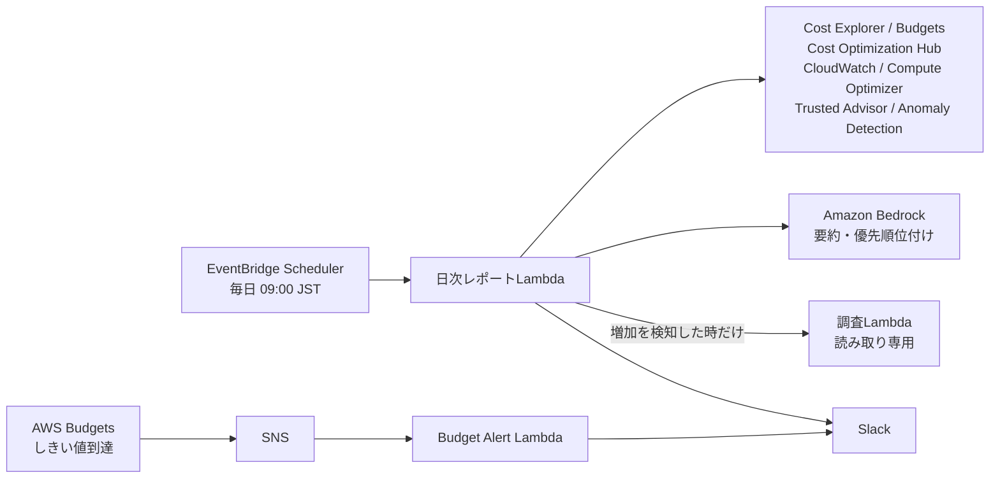

# AWS FinOps Agent for Slack

**AWSのコストを毎日ひとりで見張って、「何が変わったか」「次に何を確認すべきか」だけをSlackに届けるAgentです。**

[](./LICENSE)
[](https://nodejs.org/)
[](https://docs.aws.amazon.com/cdk/)
[](https://www.typescriptlang.org/)

Cost Explorerのダッシュボードを毎朝開く運用は続きません。このAgentは7つのAWSデータソースを横断して集計し、Amazon Bedrockで要約して、**1日1回・7ブロックのSlack通知**に落とし込みます。コストが大きく増えた日は、追加の調査Agentが読み取り専用で原因を深掘りします。

> [!IMPORTANT]
> このAgentはAWSリソースを**自動停止・削除・購入しません**。すべて読み取り専用です。通知される削減案は、必ず担当者が影響を検証してから実施してください。

---

## 通知イメージ

毎朝、こんな通知が1件だけ届きます（Slack Block Kit・最大7ブロック）。

```text
AWS FinOps｜2026-07-14｜🔴 要対応

7日コスト        前7日比
$1,245.47        ↓ $918.54 (-42.4%)

当月累計          CE月末見込
$2,995            $6,584

Budget             削減候補/月（重複除外）
🔴 $2,995 / $200  Hub $1,174（割引前）

要点
全体コストは減少していますが、S3が7/10から増加しています。
⚠ バケット別の増加元は標準のCost Explorerでは特定できません。

原因の仮説（調査Agent）
• S3: 7/10からのPutRequests増加が主因の可能性（確信度: 中）

今やること
① P0 S3増加元をCost ExplorerとStorage Lensで確認する
② P1 低利用EC2/EBSの停止・削除可否を所有者へ確認する
P0=今すぐ / P1=今週 / P2=計画

変化が大きいサービス
↑ S3 $461 (+98%)   ↓ EC2 $443 (-52%)

証拠: CW ✓ 低利用2 ｜ CO ✓ 3件 ｜ TA ✓ 1件 ｜ Budget ✓ 超過1
     ｜ Hub ✓ 4件 ｜ Tag – 0 ｜ 異常 ✓ 1件 $123.45
詳細: 内訳 ・ Budget ・ 最適化Hub ・ 異常詳細 ・ 対象リソース
凡例: CW=CloudWatch低CPU / CO=Compute Optimizer / TA=Trusted Advisor / …
```

「原因の仮説」には、調査Agentが走った日はその結論（確信度付き）が、走らなかった日はAIの観察（数値根拠付き）が表示されます。

見出しの信号は、次のルールで自動判定されます。

| 判定 | 条件 |
| --- | --- |
| 🔴 **要対応** | P0アクションがある / Budgetの実績・予測が超過 / **対応が必要な**Cost Anomaly（進行中または終了から7日以内、かつ影響額$10以上）が1件以上 |
| 🟡 **要確認** | P1アクションがある / 前7日比の絶対値が20%以上 / AI要約がフォールバック / 収集元にエラー |
| 🟢 **正常** | 上記のいずれにも該当しない |

末尾の `証拠:` 行は、どのデータソースが取得できたか（`✓`）／未設定などで取得できなかったか（`–`）を、件数付きで示します。`異常` は対応が必要な件数と影響額で、しきい値未満の過去の異常は `0（過去2）` のように表示されます。略語の凡例は通知の最下部に毎回付きます。1つ落ちても通知は止まりません。

## できること

### 📊 コストの可視化

直近7日とその前7日の比較、当月累計とCost Explorerの月末予測、変動が大きいサービス上位3件を並べます。日別の合計コストもAI分析へ渡すため、「いつから増えたか」に言及できます。

### 💰 削減候補の収集

CloudWatch（低CPUのEC2/RDS）、Compute Optimizer、Trusted Advisor、Cost Optimization Hub（重複除外済みの月額削減見込み）を横断して集めます。

### 🚨 アラートと異常検知

AWS Budgetsの実績・予測・しきい値超過は、日次レポートを待たず**即時**Slackへ。Cost Anomaly Detectionの異常と影響額も日次通知に含めます。

### 🤖 AI要約と追加調査

Bedrockが日本語の要点と優先アクション（P0/P1/P2）を生成します。さらに「前7日比 **+$100以上かつ+20%以上**」のサービスを検知すると、専用の調査Agentが Usage Type / Operation / Region 別の内訳、CloudTrailの変更履歴、リソース構成を読み取って原因仮説を立て、**確信度付きで通知の「原因の仮説」に表示します**。

### 🛡 壊れにくい通知

一部のAWS APIやAI分析が失敗しても、取得できた情報だけで通知を継続します。Agentが黙って止まることを避ける設計です。

## しないこと

期待値を合わせるため、意図的に実装していない範囲を明示します。

- **リソースの変更** — 停止・削除・リサイズ・Savings Plans購入は行いません（IAMにも変更権限を付与していません）
- **Slackからの対話** — 通知は一方向です。質問応答・承認ワークフロー・自動修復はありません
- **マルチアカウント横断の詳細分析** — Cost Explorerは請求アカウント全体を見ますが、CloudWatch / Compute Optimizerはデプロイ先の1リージョンのみです
- **バケット/プレフィックス単位のS3課金分析** — 標準のCost Explorerでは特定できません。Storage LensまたはCUR（Cost and Usage Report）の併用が必要です

詳しい制約は[運用ガイド](./docs/operations.md#既知の制約)にまとめています。

## クイックスタート

所要時間は約15分（CDK bootstrap済みの場合）。ここでは最短経路だけを示します。前提条件・dry-run・Budget即時通知の接続を含む完全な手順は **[セットアップガイド](./docs/setup.md)** を参照してください。

**必要なもの**: Node.js 22+ / AWS CLI v2 / Cost Explorer有効化済みのAWSアカウント / Bedrockモデルへのアクセス / Slack Incoming Webhook

```bash
# 1. 依存関係とAWS認証
npm ci
export AWS_PROFILE=your-profile AWS_REGION=ap-northeast-1
aws sso login --profile "$AWS_PROFILE"

# 2. Slack WebhookをSecrets Managerへ保存（コードには絶対に書かない）
aws secretsmanager create-secret \
  --name finops/slack-webhook \
  --secret-string '{"url":"https://hooks.slack.com/services/REPLACE_ME"}' \
  --region "$AWS_REGION"

# 3. まず定期実行を無効にしてデプロイし、手動実行で動作確認
npx cdk deploy \
  -c deploymentRegion="$AWS_REGION" \
  -c slackWebhookSecretName=finops/slack-webhook \
  -c scheduleEnabled=false \
  -c createAnomalyMonitor=false

# 4. 通知内容を確認できたら定期実行を有効化（毎日09:00 JST）
#    Cost Anomaly monitorを新規作成したい場合のみ createAnomalyMonitor=true
npx cdk deploy \
  -c deploymentRegion="$AWS_REGION" \
  -c scheduleEnabled=true \
  -c createAnomalyMonitor=false
```

> [!TIP]
> 手順3のあと、Slackへ投稿せずに動作を確かめる **dry-run** ができます。`{"dryRun":true}` でLambdaを直接呼ぶだけです → [セットアップガイド 手順6](./docs/setup.md#6-slackへ投稿しないdry-run)

## 構成


```mermaid
flowchart LR
  S["EventBridge Scheduler<br/>毎日 09:00 JST"] --> L["日次レポートLambda"]
  L --> D["Cost Explorer / Budgets<br/>Cost Optimization Hub<br/>CloudWatch / Compute Optimizer<br/>Trusted Advisor / Anomaly Detection"]
  L --> B["Amazon Bedrock<br/>要約・優先順位付け"]
  L -->|"増加を検知した時だけ"| I["調査Lambda<br/>読み取り専用"]
  L --> SL["Slack"]
  BU["AWS Budgets<br/>しきい値到達"] --> SNS["SNS"] --> BA["Budget Alert Lambda"] --> SL
```

日次レポートLambdaと調査LambdaはIAMロールを分離しており、調査LambdaにはSlack Webhookの読み取り権限すらありません。詳細は[アーキテクチャ](./docs/architecture.md)と[IAMとセキュリティ](./docs/security.md)を参照してください。

## ドキュメント

| ドキュメント | 読むタイミング |
| --- | --- |
| 📦 [セットアップガイド](./docs/setup.md) | **最初に読む。** 前提条件から9ステップの導入、dry-run、Budget即時通知、アンインストールまで |
| 🏗 [アーキテクチャ](./docs/architecture.md) | 全体構成、データソース一覧、調査Agentの動作、作成されるAWSリソース、設計判断の背景 |
| ⚙️ [設定リファレンス](./docs/configuration.md) | しきい値・モデル・スケジュールを変えたいとき。CDK context / 環境変数の全一覧 |
| 🔐 [IAMとセキュリティ](./docs/security.md) | セキュリティレビュー時。ロール別の権限一覧と権限分離の方針 |
| 🔧 [運用ガイド](./docs/operations.md) | **通知が来ない・数値がおかしいとき。** Agent自体のコスト、ログの見方、トラブルシューティング、既知の制約 |

## 開発

```bash
npm ci          # 依存関係のインストール
npm test        # ユニットテスト（tsx --test）
npm run build   # 型チェック（tsc --noEmit）
npx cdk synth   # CloudFormationテンプレートの生成確認
```

テストは、集計日付範囲の計算、サービス別コスト比較、AI構造化出力のパース、Slack通知が簡潔さの制約を守っているかを検証します。

### ディレクトリ構成

```text
.
├── bin/finops-feedback.ts           # CDK Appのエントリポイントと設定解決
├── lib/
│   ├── finops-feedback-stack.ts     # 日次レポートのAWSリソースとIAM
│   └── finops-budget-alert-stack.ts # Budget即時Slack通知用の分離スタック
├── src/
│   ├── handler.ts                   # 日次レポート本体（集計 → Bedrock → Slack）
│   ├── collectors.ts                # 各FinOpsデータソースの収集
│   ├── investigation-handler.ts     # 条件付きの読み取り専用調査Agent
│   └── budget-alert-handler.ts      # Budget SNSイベントをSlackへ中継
├── test/handler.test.ts             # ユニットテスト
├── docs/                            # 詳細ドキュメント
├── cdk.json                         # CDKの既定context
└── .env.example                     # ローカル設定の雛形（秘密値なし）
```

## Contributing

IssueやPull Requestを歓迎します。このプロジェクトには守りたい設計上の制約があるため、変更前に次を確認してください。

1. **AWSリソースを変更する権限をLambdaへ追加しない** — このAgentが読み取り専用であることは中心的な設計方針です
2. **新しいデータソースの失敗が通知全体を止めないようにする** — 収集は個別にフォールバックさせ、`collectorStatus` へ反映してください
3. **Slack通知を7ブロック程度に保つ** — 情報を詰め込むほど読まれなくなります
4. **`npm test` / `npm run build` / `npx cdk synth` が通ることを確認する**
5. **アカウントID、リソースID、Webhook URL、実際のコストデータをコミットしない**

## ライセンス

[MIT License](./LICENSE)
</content>
