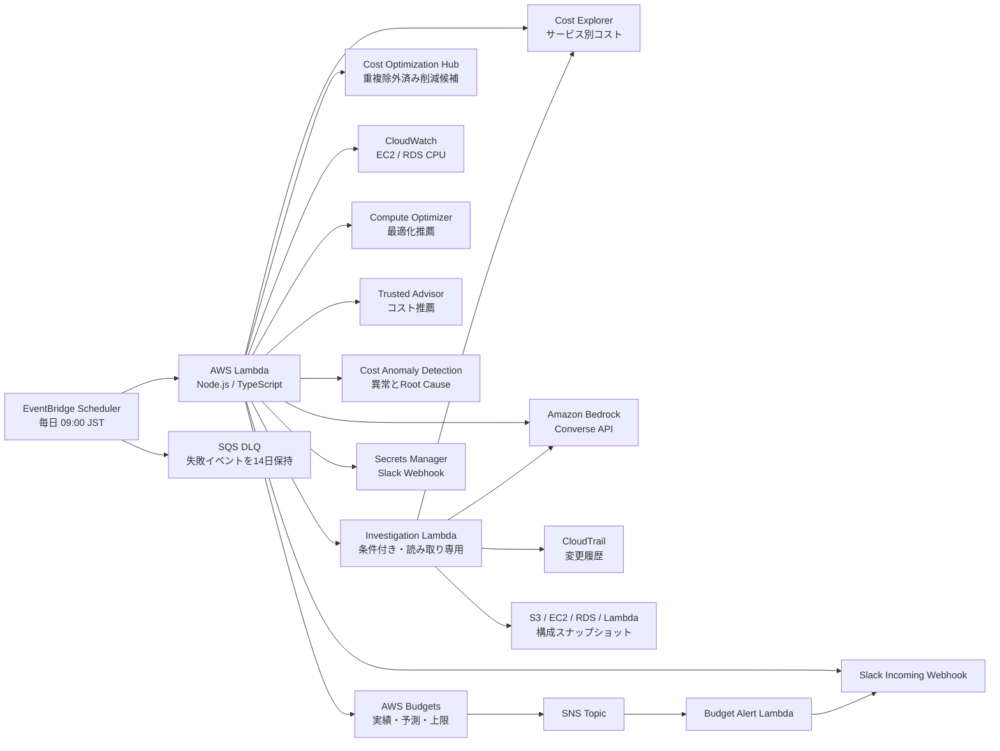

# アーキテクチャ



## データソース

| データソース | 対象 | リージョン |
| --- | --- | --- |
| Cost Explorer | 請求アカウント全体、サービス別の日次コスト | `us-east-1` API |
| AWS Budgets | COST budgetの実績・予測・上限超過 | `us-east-1` API |
| Cost Optimization Hub | 重複を除外した最適化候補と月額削減見込み | `us-east-1` API |
| Cost allocation tags | 有効なタグキーのみ | `us-east-1` API |
| CloudWatch | EC2/RDSのCPU利用率 | デプロイ先リージョン |
| Compute Optimizer | EC2/EBS/Lambda/RDS/アイドル推薦 | デプロイ先リージョン |
| Trusted Advisor | コスト最適化Recommendation | グローバル |
| Cost Anomaly Detection | 直近30日のコスト異常 | グローバル |
| 調査Agent | 増加サービスの内訳、CloudTrail、リソース構成 | Cost Explorerは`us-east-1`、他はデプロイ先リージョン |
| Amazon Bedrock | 収集結果の要約と優先順位付け | 設定したBedrockリージョン/推論プロファイル |

## 調査Agentの動き

日次レポートの作成後、次の条件を満たすサービスだけを調査します。初期値は「直近7日が前の7日より **$100以上** かつ **20%以上** 増加」です。前期間が$0の新規サービスは、金額条件だけで対象になります。Taxは対象外です。

```text
定型コードで増加を検知
  → 専用LambdaがSonnet 5のTool Useで必要な読み取りを選択
  → 実装側が入力・対象サービス・回数を検証してAWS APIを実行
  → Sonnet 5が観測事実 / 原因仮説 / 確信度を分けて要約
```

Agentに書き込み系のAPI、Slack Webhook、Secrets Manager権限はありません。日次通知Lambdaと調査LambdaのIAMロールは分離されています。Agentの結論はあくまで根拠付きの仮説であり、削除・停止・購入・設定変更を実行するものではありません。

## 作成されるAWSリソース

- AWS Lambda（Node.js 22、5分タイムアウト、同時実行数1）
- 調査専用AWS Lambda（Node.js 22、3分タイムアウト、同時実行数1、Slack投稿権限なし）
- Lambda実行ロールと読み取り中心のIAMポリシー
- EventBridge Scheduler（日次実行）
- SQS Dead Letter Queue（14日保持）
- CloudWatch Logs Log Group（30日保持、スタック削除後も保持）
- Cost Anomaly monitor（`createAnomalyMonitor=true`の場合）
- `FinOpsBudgetAlertStack`をデプロイした場合: SNS Topic、Budget Alert Lambda、既存Budget通知へのSNS購読

Slack Webhook用Secretは既存Secretを参照するため、このスタックでは作成・削除しません。

## 設計メモ: Claude Code SDKではなくBedrock Tool Useを使う理由

この実装は、スケジュールされた短時間の分析処理としてAmazon Bedrock Converse APIを直接呼び出します。日次要約には構造化出力、追加調査にはConverse Tool Useを使います。Lambdaの実行時間、IAM境界、構造化出力、デプロイサイズを管理しやすくするためです。

「定型的な検知・認可」はコードで固定し、「どの読み取り証拠を追加するか」と「根拠の要約」はSonnetに委ねています。Claude Code SDKが提供するシェル、ファイル編集、広いツール実行環境は、この読み取り専用の定期ジョブには不要です。Slackから任意の質問を受け付ける対話型Agent、複数アカウント横断のMCP基盤、長い調査状態が必要になった段階で、Bedrock AgentCoreを検討してください。
