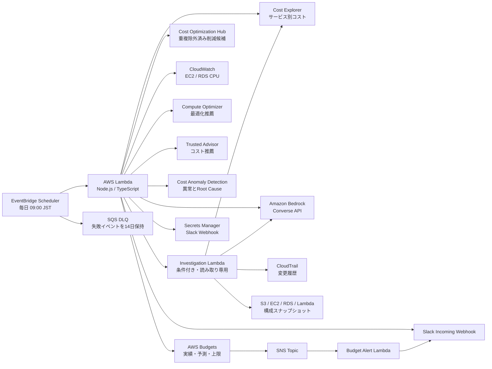

# アーキテクチャ

## 全体像


```mermaid
flowchart LR
  S["EventBridge Scheduler<br/>毎日 09:00 JST"] --> L["AWS Lambda<br/>Node.js / TypeScript"]
  L --> CE["Cost Explorer<br/>サービス別コスト"]
  L --> BU["AWS Budgets<br/>実績・予測・上限"]
  L --> COH["Cost Optimization Hub<br/>重複除外済み削減候補"]
  L --> CW["CloudWatch<br/>EC2 / RDS CPU"]
  L --> CO["Compute Optimizer<br/>最適化推薦"]
  L --> TA["Trusted Advisor<br/>コスト推薦"]
  L --> CA["Cost Anomaly Detection<br/>異常とRoot Cause"]
  L --> B["Amazon Bedrock<br/>Converse API"]
  L --> I["Investigation Lambda<br/>条件付き・読み取り専用"]
  I --> CE
  I --> CT["CloudTrail<br/>変更履歴"]
  I --> RI["S3 / EC2 / RDS / Lambda<br/>構成スナップショット"]
  I --> B
  L --> SM["Secrets Manager<br/>Slack Webhook"]
  L --> SL["Slack Incoming Webhook"]
  S --> DLQ["SQS DLQ<br/>失敗イベントを14日保持"]
  BU --> SNS["SNS Topic"] --> BA["Budget Alert Lambda"] --> SL
```

Slackへ通知が届く経路は2つあります。

1. 日次レポート（スケジュール実行）：EventBridge Scheduler → 日次レポートLambda → Slack
2. Budget即時通知（イベント駆動）：AWS Budgets → SNS → Budget Alert Lambda → Slack（[`FinOpsBudgetAlertStack`](./setup.md#9-budgetしきい値をslackへ即時通知) をデプロイした場合のみ）

## 日次レポートの処理の流れ

```text
1. 集計期間を決定        直近7日と、その前の7日（当日は未確定のため除外）
2. コストを取得          Cost Explorer でサービス別・日別に集計し、前の7日と比較
3. 証拠を並列収集        Budgets / Hub / CloudWatch / Compute Optimizer
                        / Trusted Advisor / Anomaly Detection / タグ
                        → 個別に成否を記録（ok / unavailable / error）
4. 増加を検知            前7日比 +$100以上 かつ +20%以上 のサービスを抽出
5. 追加調査（条件付き）   該当サービスがあれば調査Lambdaを同期呼び出し
6. AIで要約              Bedrock Converse API の構造化出力で
                        要点・観察・P0/P1/P2アクション・注意点を生成
7. Slackへ投稿           Block Kit で最大7ブロックに整形
                        （調査の結論は「原因の仮説」として確信度付きで表示）
```

手順3のいずれかが失敗しても、手順6・7は取得できた情報だけで続行します。手順6が失敗した場合も、数値ベースのフォールバック通知（`aiFallback: true`）へ切り替わります。**Agentが黙って何も通知しない状態を作らない**ことを優先した設計です。

## データソース

| データソース | 取得内容 | 呼び出しリージョン |
| --- | --- | --- |
| Cost Explorer | 請求アカウント全体、サービス別の日次コスト、月末予測 | `us-east-1` |
| AWS Budgets | COST budgetの実績・予測・上限超過 | `us-east-1` |
| Cost Optimization Hub | 重複を除外した最適化候補と月額削減見込み | `us-east-1` |
| Cost allocation tags | 有効なタグキーの一覧のみ | `us-east-1` |
| CloudWatch | EC2 / RDSのCPU利用率 | デプロイ先リージョン |
| Compute Optimizer | EC2 / EBS / Lambda / RDS / アイドルリソースの推薦 | デプロイ先リージョン |
| Trusted Advisor | コスト最適化Recommendation | グローバル |
| Cost Anomaly Detection | 直近30日のコスト異常とRoot Cause | グローバル |
| 調査Agent | 増加サービスの内訳、CloudTrail変更履歴、リソース構成 | Cost Explorerは`us-east-1`、他はデプロイ先リージョン |
| Amazon Bedrock | 収集結果の要約と優先順位付け | 設定したBedrockリージョン / 推論プロファイル |

> [!NOTE]
> Cost Explorer系のAPIは`us-east-1`にしか存在しないため、Lambdaを東京リージョンへ置いても呼び出し先は`us-east-1`になります。一方でCloudWatchとCompute Optimizerはリージョン単位のサービスなので、**デプロイ先の1リージョンしか見ていません**。

## 調査Agentの動き

日次レポートの集計後、条件を満たしたサービスだけを深掘りします。

**起動条件**（[設定で変更可能](./configuration.md#調査agentとモデル)）

- 直近7日が前の7日より **+$100以上** かつ **+20%以上** 増加
- 前期間が$0の新規サービスは、金額条件のみで対象
- Taxは対象外
- 1回のレポートで調査するサービスは最大3件

**処理**

```text
定型コードで増加を検知
  → 調査LambdaがBedrock Tool Useで「どの読み取りが必要か」を選択
  → 実装側が入力・対象サービス・呼び出し回数を検証してからAWS APIを実行
  → 観測事実 / 原因仮説 / 確信度 を分けて要約
  → 結論はSlack通知の「原因の仮説（調査Agent）」に確信度付きで表示
```

**使えるツール**（すべて読み取り専用）

- Cost Explorerの Usage Type / Operation / Region 別内訳
- CloudTrailの変更履歴（`LookupEvents`）
- S3 / EC2 / RDS / Lambda の構成スナップショット

> [!IMPORTANT]
> 調査Agentに書き込み系API、Slack Webhook、Secrets Managerの権限はありません。日次レポートLambdaと調査LambdaのIAMロールは分離されています。
> Agentの結論は**根拠付きの仮説**であり、削除・停止・購入・設定変更を実行するものではありません。

「増加の検知」と「呼び出しの認可」はコードで固定し、「どの読み取り証拠を追加するか」と「根拠の要約」だけをモデルに委ねています。モデルのプロンプトを認可の根拠にしない、という切り分けです。

## 作成されるAWSリソース

### `FinOpsFeedbackStack`

| リソース | 設定 |
| --- | --- |
| 日次レポートLambda | Node.js 22 / メモリ768MB / タイムアウト5分 / 同時実行数1 |
| 調査Lambda | Node.js 22 / メモリ768MB / タイムアウト3分 / 同時実行数1 / Slack投稿権限なし |
| Lambda実行ロール × 2 | 読み取り中心のIAMポリシー（[詳細](./security.md)） |
| EventBridge Scheduler | 日次実行（`scheduleEnabled` で有効/無効） |
| SQS Dead Letter Queue | Scheduler失敗イベントを14日保持 |
| CloudWatch Logs Log Group × 2 | 30日保持 / スタック削除後も保持（`RETAIN`） |
| Cost Anomaly monitor | `createAnomalyMonitor=true` の場合のみ |

### `FinOpsBudgetAlertStack`（任意）

| リソース | 設定 |
| --- | --- |
| SNS Topic | Budget通知の受け口 |
| Budget Alert Lambda | Node.js 22 / タイムアウト30秒 |
| 既存Budget通知へのSNS購読 | Custom Resourceで実績しきい値へ追加 |
| 予測しきい値のSlack通知 | Custom Resourceで1件を管理 |

Slack Webhook用のSecretは**既存Secretを参照するだけ**なので、どちらのスタックも作成・削除しません。

## 設計判断: なぜClaude Code SDKではなくBedrock Tool Useか

この実装は、Amazon Bedrock Converse APIを直接呼び出します。日次要約には構造化出力、追加調査にはConverse Tool Useを使います。

**理由**: Lambdaの実行時間、IAM境界、出力スキーマ、デプロイサイズをすべて明示的に管理したかったためです。Claude Code SDKが提供するシェル実行、ファイル編集、広いツール環境は、読み取り専用の定期ジョブには不要であり、IAM境界を曖昧にする方向に働きます。

**将来的にAgentCoreを検討すべきタイミング**:

- Slackから任意の質問を受け付ける対話型Agentにしたいとき
- 複数アカウント横断のMCP基盤が必要になったとき
- 長時間・状態を持つ調査セッションが必要になったとき
</content>
